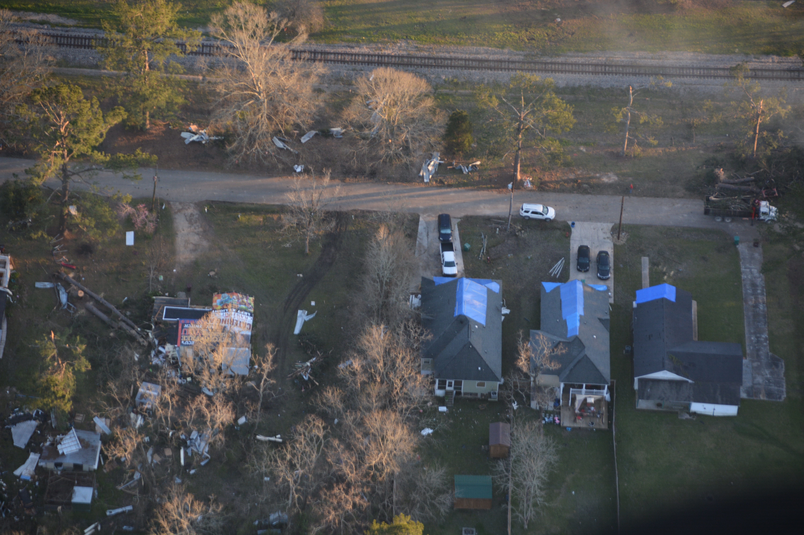

# LADI Dataset Documentation

- [LADI Dataset Documentation](#ladi-dataset-documentation)
  - [Download](#download)
  - [Using AWS S3 Console](#using-aws-s3-console)
    - [Download LADI to Local Machine with AWS Command Line Interface](#download-ladi-to-local-machine-with-aws-command-line-interface)
    - [Transfer LADI to Your Own S3 Bucket](#transfer-ladi-to-your-own-s3-bucket)
  - [Access and Download LADI Data via Web Browser](#access-and-download-ladi-data-via-web-browser)
- [Load LADI in Python3](#load-ladi-in-python3)
  - [LADI Stored in S3 Bucket](#ladi-stored-in-s3-bucket)
  - [LADI Stored in Local Machine](#ladi-stored-in-local-machine)
  - [Distribution Statement](#distribution-statement)

## Download

Data in LADI is stored in AWS S3 storage. To access or download images, metadata, and labels in LADI, you can optionally choose to work with Amazon AWS Console or not.

## Using AWS S3 Console

To use Amazon S3, you need an AWS account. If you do not have one yet, please visit the [Amazon Web Services Homepage](https://aws.amazon.com/) and follow the tutorial on [Create and Activate an AWS Account](https://aws.amazon.com/premiumsupport/knowledge-center/create-and-activate-aws-account/) to create an AWS account.

After you have created and activated your account, you can choose to download LADI from AWS S3 to your local machine using AWS Command Line Interface or transfer LADI dataset into your own S3 bucket.

### Download LADI to Local Machine with AWS Command Line Interface

1. Go to [AWS Command Line Interface User Guide](https://docs.aws.amazon.com/cli/latest/userguide/cli-chap-install.html) to install AWS CLI on your system. You have the options to install AWS CLI on Linux, MacOS, Windows and Virtual Environment.

2. Verify that AWS CLI is installed correctly.

   ```shell
   $aws --version
   aws-cli/1.17.12 Python/3.7.3 Darwin/19.3.0 botocore/1.14.12
   ```

3. Create a new administrator IAM User.  Go to [Creating Your First IAM Admin User and Group](https://docs.aws.amazon.com/IAM/latest/UserGuide/getting-started_create-admin-group.html) to create a new IAM User. After you have created a new IAM User, please go to [Navigation Pane for Users](https://console.aws.amazon.com/iam/home#/users) to verify.

4. Configure the AWS CLI.

   ```shell
   $aws configure
   AWS Access Key ID [None]: 
   AWS Secret Access Key [None]:
   Default region name [None]: 
   Default output format [None]: 
   ```

   Please fill in each field step by step with your own values. The `AWS Access Key ID` and `AWS Secret Access Key` can be found by going to [Navigation Pane for Users](https://console.aws.amazon.com/iam/home#/users), choosing the IAM User that you just created, e.g. **Administrator**, clicking on the **Security credentials** tab and tapping the **Create access key** button.  
   For more information and details, please visit [Configuring the AWS CLI](https://docs.aws.amazon.com/cli/latest/userguide/cli-chap-configure.html).

5. Run the following command to download the LADI dataset. The` --recursive` flag specifies that subdirectories should be copied.

   ```shell
   $aws s3 cp s3://ladi/path/to/remote path/to/local --recursive
   ```

   `path/to/remote` should be replaced with the path of the data within the LADI S3 bucket and `path/to/local` represents the local path where the files will be written.

6. Go to the local path specified in the previous step and verify the requested files from LADI has been downloaded.

### Transfer LADI to Your Own S3 Bucket

1.  Please follow Step 1 to Step 4 in the "Download LADI to Local Machine with AWS Command Line Interface" section to install and configure AWS CLI.

2. Sign in to the AWS Management Console and open the [Amazon S3 console](https://console.aws.amazon.com/s3/).

3. Follow the tutorial on [Creating an S3 Bucket](https://docs.aws.amazon.com/AmazonS3/latest/user-guide/create-bucket.html) to create a bucket.

4. Go to the [Amazon S3 console](https://console.aws.amazon.com/s3/) to verify that your new bucket has been created.

5. Run the following command to copy data from the original LADI S3 bucket to your own bucket.

   ```shell
   $aws s3 cp s3://ladi/path/to/remote s3://yourbucketname/yourpath --recursive
   ```

   `path/to/remote` should be replaced with the path of the data within the LADI S3 bucket, `yourbucketname` should be replaced with the name of your new bucket and `yourpath` represents the bucket path where the files will be written.

6. Go to the [Amazon S3 console](https://console.aws.amazon.com/s3/) to verify that the requested files from LADI have been transferred.

## Access and Download LADI Data via Web Browser

Without Amazon AWS account and services, users can also access and download files in LADI by going to http://ladi.s3-us-west-2.amazonaws.com/index.html using a web browser. However, due to efficiency of downloading the data, we highly recommend to use AWS CLI.

# Load LADI in Python3

Users can load files and data from LADI in Python 3 by using AWS Python SDK Boto 3 if the dataset is stored in AWS S3 bucket. LADI can also be load using other packages: Pandas, NumPy and PyTorch. Using the following command to install these packages:

- Boto 3

  ```shell
  $pip install boto3
  ```

  For more information for installing Boto3, please go to [Boto 3 Quickstart](https://boto3.amazonaws.com/v1/documentation/api/latest/guide/quickstart.html).

- Pandas

  ```shell
  $pip install pandas
  ```

  For more information for installing Pandas with Anaconda and Miniconda, please go to [Pandas Installation](https://pandas.pydata.org/pandas-docs/stable/getting_started/install.html).

- Numpy

  ```shell
  $pip install numpy
  ```

  For more installation options, please visit [SciPy Installation](https://scipy.org/install.html).

- PyTorch

  ```shell
  $pip install torch torchvision
  ```

  For more details on installing PyTorch, please visit [PyTorch Start Locally](https://pytorch.org/get-started/locally/).

  *Note: If you are a Mac user, replace pip with pip3 in the commands above to install those packages. If you are installing those packages via Anaconda, please refer to the links provided above for more information about commands to use for installation.*

## LADI Stored in S3 Bucket

If you transferred LADI into your own AWS S3 bucket and prefer to not store the files to your local machine, Boto 3, the AWS Python SDK, can help you access and read files in S3 bucket.
*Example: Using Boto3 and Pandas to read a .csv file from LADI stored in S3 bucket.*

1. To access the AWS S3 bucket import package Boto 3.

2. Initiate "clients" tool in Boto3.  “Clients” are low-level functional interfaces which are useful to load single files.

   ```python
   import pandas as pd
   import boto3
   
   #replace 'bucket name' to your s3 bucket name
   bucket_name = 'bucket_name'
   #replace 'ladi_images_metadata.csv' with the path of the file that you want to read
   file_1_path = 'ladi_images_metadata.csv'
   client = boto3.client('s3')
   obj_1 = client.get_object(Bucket = bucket_name, Key = file_1_path)
   image_metadata = pd.read_csv(obj_1['Body'])
   #If you are loading tsv file
   #ladi_response = pd.read_csv(obj_1['Body'],sep = '\t' )
   ```

   `obj` contains metadata of the file and the `Body` of the object contains actual data in a `StreamingBody` format. If we display first 10 rows in the `image_metadata`, we can get a table as following:
   

## LADI Stored in Local Machine

If you downloaded LADI to your local machine, you are able to read the files using Pandas and other packages without the assistance of Boto 3.

*Example: Read and display an image from the LADI dataset on a local machine.*

There are multiple effective ways in Python to read and display an image file. In this example, we use Python Imaging Library (PIL) and matplotlib to read and show an image.

```python
from PIL import Image
import matplotlib.pyplot as plt

image_path = 'Images/FEMA_CAP/1012/20118/VIRB0002_fa5065eb-773a-4b41-8f2c-80a734f3770d.jpg'

im = Image.open(image_path)
plt.imshow(im, cmap='Greys_r')
```


## Distribution Statement

[BSD -Clause License](https://github.com/LADI-Dataset/ladi-tutorial/blob/master/LICENSE)
