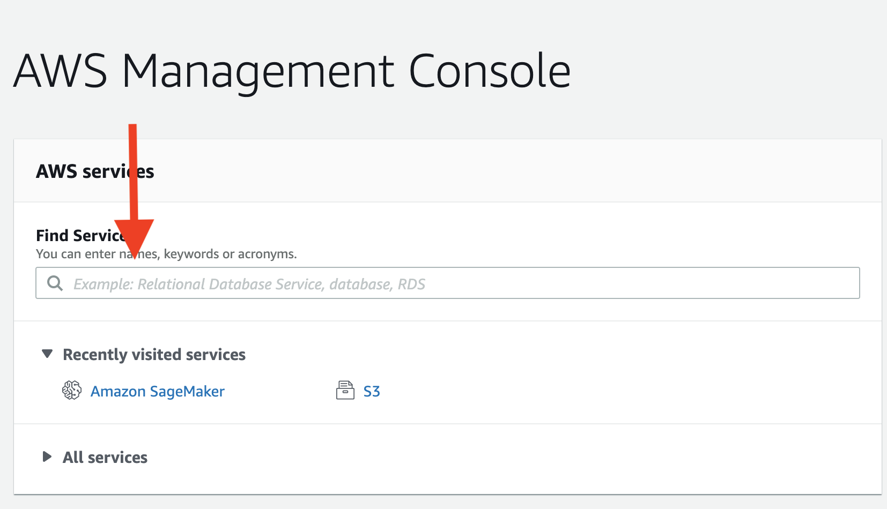
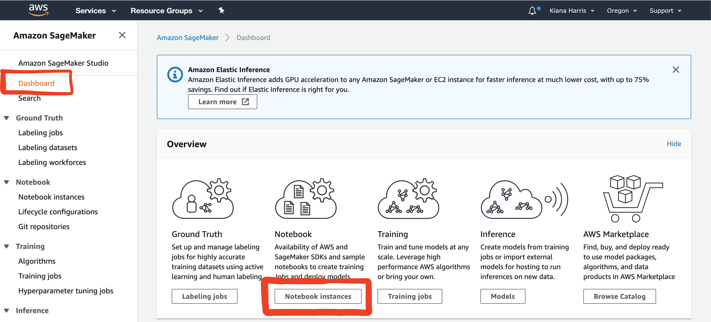
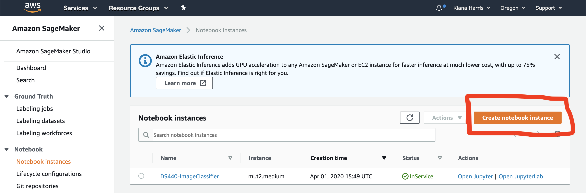
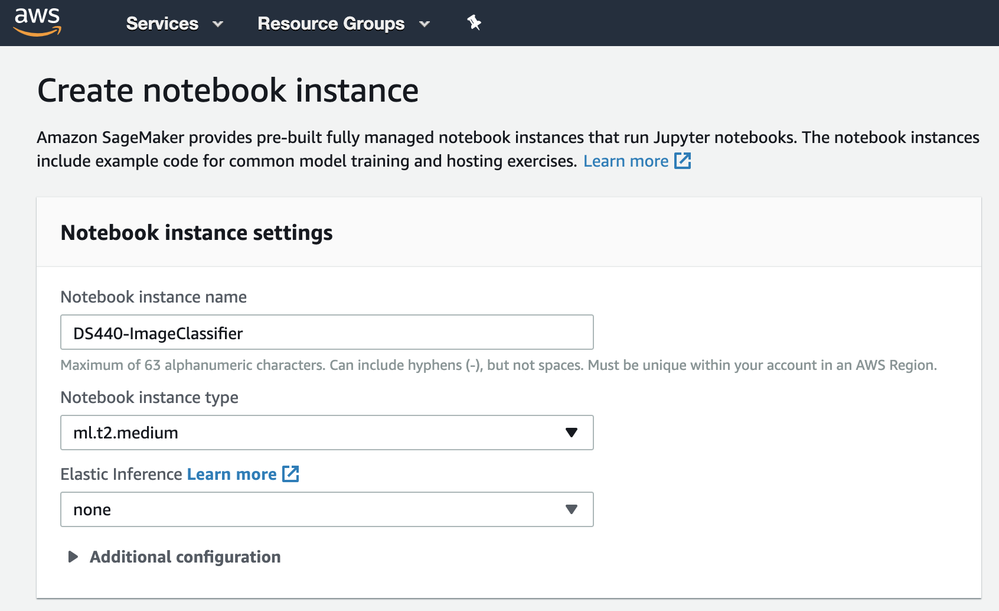
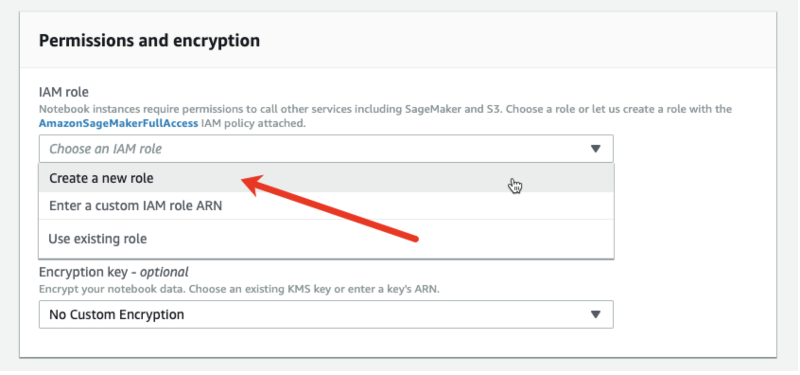
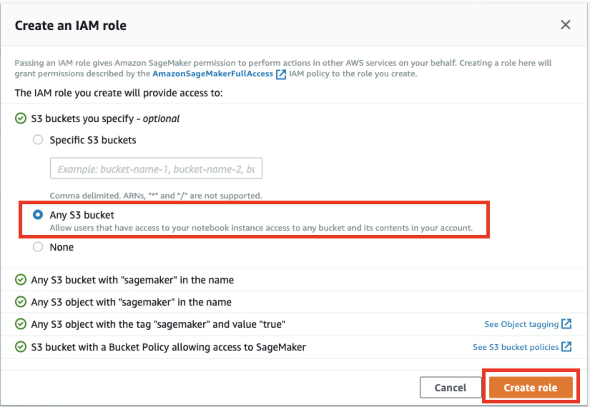
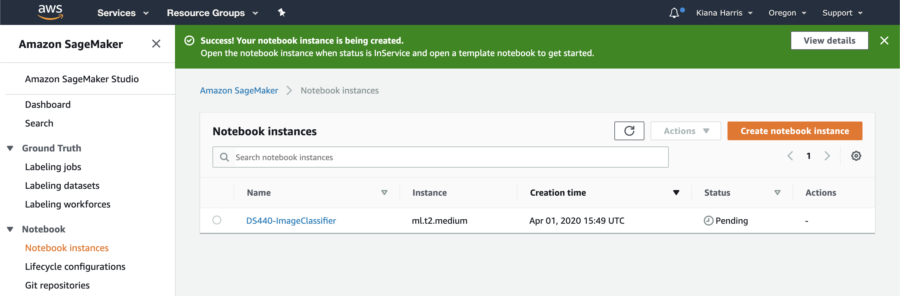

# SageMaker - Build, Train, and Deploy ML Model

*If you have not set up an AWS Account (free tier can be used for SageMaker), please do so before continuing*.

- [SageMaker - Build, Train, and Deploy ML Model](#sagemaker---build-train-and-deploy-ml-model)
  - [Basic Walkthrough](#basic-walkthrough)
  - [Distribution Statement](#distribution-statement)

## Basic Walkthrough

1. Enter Amazon SageMaker console

2. Navigate to the Amazon SageMaker dashboard located in the left-hand panel and select **Notebook Instances**.

3. Select **Create notebook instance** button to begin creating the notebook instance.

4. Enter a name in the **Notebook instance name** field.  Keep ml.t2.medium as the **Notebook instance type**.

5. An IAM role must be specified to enable the notebook instance to access and securely upload data to Amazon S3.  In the **IAM role** field, choose **Create a new role** to have Amazon SageMaker create a role with the required permissions and assign it to your instance.

6. In the **Create an IAM role** box, select **Any S3 bucket**.  This allows your Amazon SageMaker instance to access all S3 buckets in your account.  For now, we will allow **Any S3 bucket** until we upload our our own bucket.

   1. If you would like to clone our Git respository for your notebook instance, go to the **Git repositories** box and select **Clone a public Git repository to this notebook instance only**.  Then insert "https://github.com/LADI-Dataset/ladi-tutorial.git" in the **Git repository URL** box.

7. Choose **Create role**.

8. On the **Notebook instances** page, your new instance with your specified name should be shown with a **Pending** status.  Your noteobok instance should transition from **Pending** to **InService** status in less than 2 minutes.

## Distribution Statement

[BSD -Clause License](https://github.com/LADI-Dataset/ladi-tutorial/blob/master/LICENSE)
